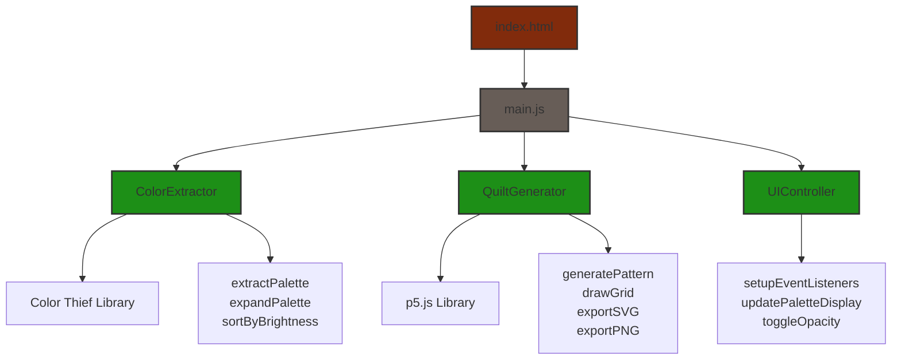

# Custom Quilt Design Facility

A practical tool to extract color palettes and determine color distribution in patchwork artworks.

## Features
- 🎨 Extract 24-color palette from an image
- 🔄 Generate unique quilt patterns
- 💾 Export as PNG or SVG
- ⌨️ Keyboard shortcuts
- 🖱️ Drag & drop support
- ↩️ Undo/Redo functionality

## Usage
1. Upload an image or drag & drop
2. Click Generate or press `G` for new patterns
3. Export using `Cmd/Ctrl + S` (SVG) or `Cmd/Ctrl + P` (PNG)
4. Press `H` for all shortcuts

## Live Demo
[Visit the app](https://stephanedelgado.github.io/quilt-pattern-generator/)

## Technologies
- p5.js for canvas rendering
- Color Thief for palette extraction
- Tailwind CSS for styling
- Vanilla JavaScript ES6 modules

## Responsive layout
- No overflow: `max-width: 450px` caps desktop, `width: 100%` shrinks on mobile
- `windowResized()` calculates p5 canvas size dynamically and keeps it in sync with its container

## License
MIT

